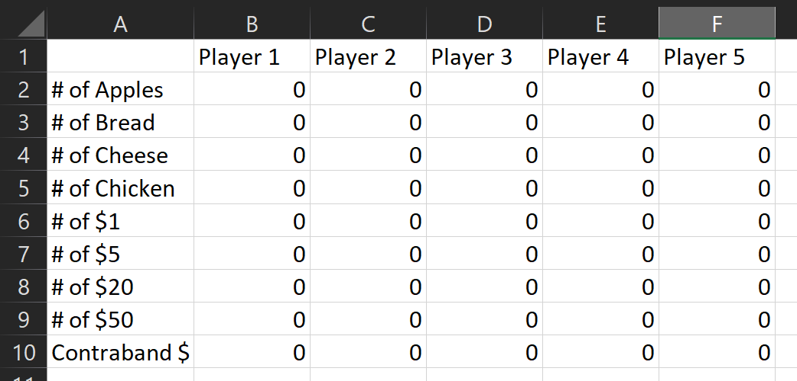
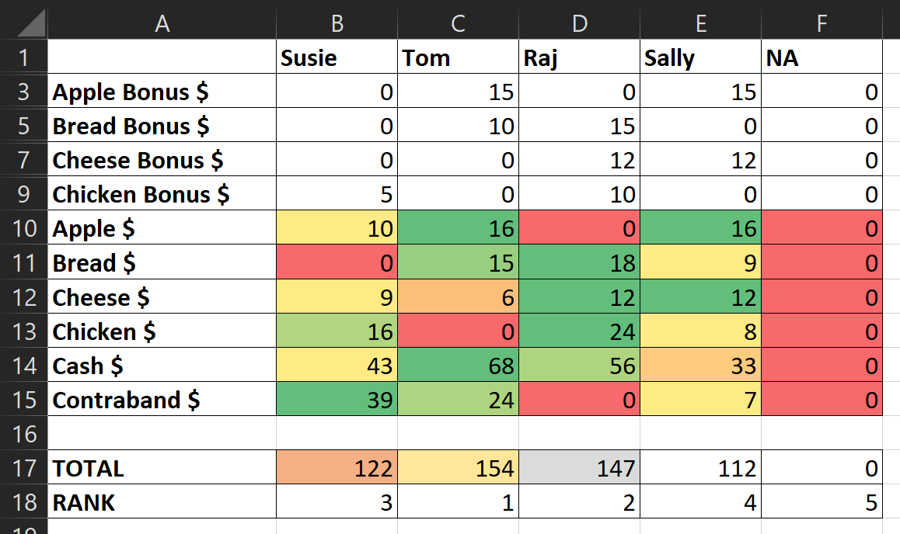

# Sheriff of Nottingham Card Game Scoring Spreadsheet
Easy scoring for the Sheriff of Nottingham card game by Arcane Wonders.

# How it Works
There are two sheets.

## Data entry

* Enter players' names across the top
* Enter quantities and values

NOTE: If you have fewer than five players, simply do not enter any data for the remaining columns.

## Results

Switch to the 'Results' sheet to see who won. Note the following features:

* Each player is ranked and the first 3 players are given Gold, Silver, Bronze color coding.
* Bonuses are automatically awarded and ties are automatically resolved according to the rules.
* Dollar values are color scaled across users. This helps call out why a player won so you can see what strategy came out on top.
